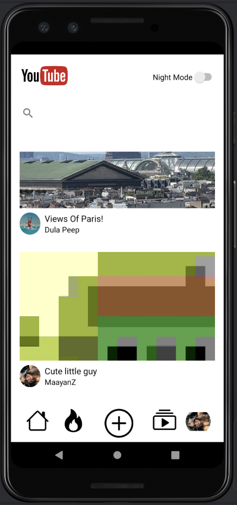
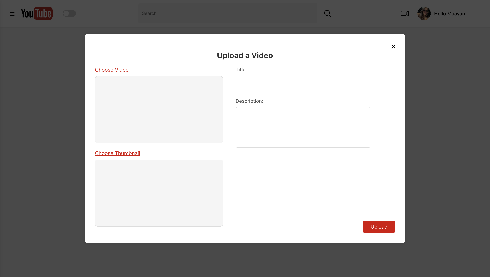

# Upload of the Video in the Android

The following image illustrates the process of uploading a video in the Android application:

After this step, the next phase in the Android video upload process is shown below:

After the upload is complete, the video is displayed on the homepage of the Android application:

After the upload is complete, the video is displayed on the homepage of the Android application:

# Upload of the Video on the Web

The image below demonstrates the process of uploading a video on the web application:

